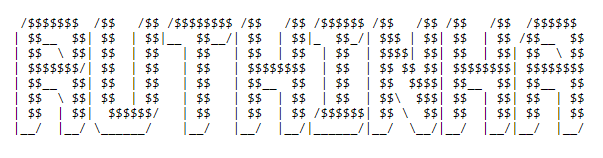
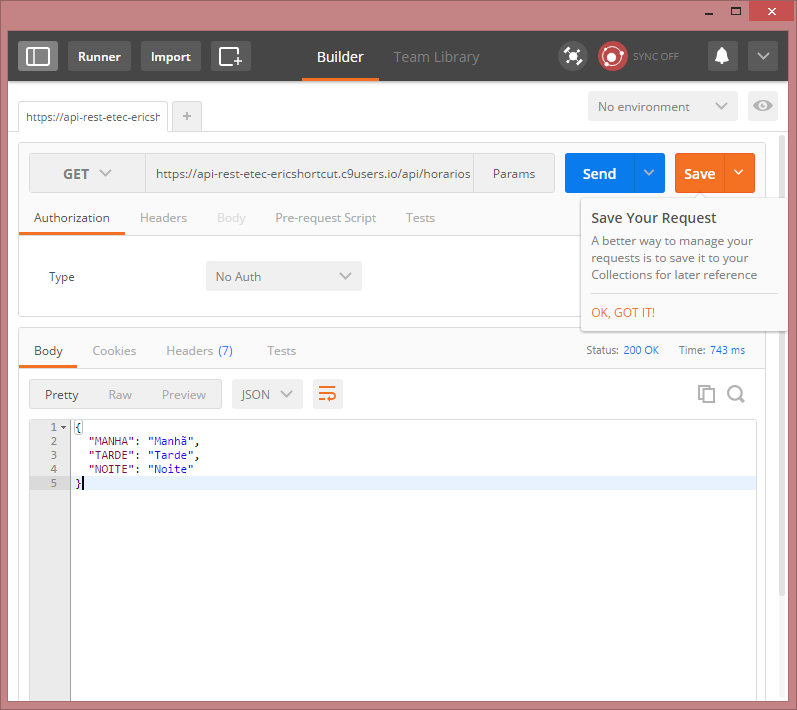

# Primeiro Passo

Instalar o Composer

``` curl -s https://getcomposer.org/installer | php ```

Criar uma pasta ```mkdir api```


Criar um arquivo  dentro da pasta api ```composer.json```

Colocar o seguinte conteúdo dentro do arquivo ```composer.json```
```
{
    "require": {
        "slim/slim": "2.*"
    }
}
```

Execute o comando ```composer install``` dentro da pasta ```api```

# Segundo passo

Acessar a API do slim [LINK PARA API](http://docs.slimframework.com/)

Executar a máquina no c9 ```Run Project```

Criar arquivo ```index.php``` dentro da pasta API e arquivo ```.htaccess``` na raiz do servidor

index.php
```
<?php

require 'vendor/autoload.php';

$app = new \Slim\Slim();
$app->get('/hello/:name', function ($name) {
    echo "Hello, " . $name;
});
$app->run();
```

.htaccess
```
RewriteEngine On
RewriteBase /api/
RewriteRule ^index\.php$ - [L]
RewriteCond %{REQUEST_FILENAME} !-f
RewriteCond %{REQUEST_FILENAME} !-d
RewriteRule . /api/index.php [L]
```

Executando o primeiro teste na API

Utilizamos o postman para facilitar o teste. Para baixar o postman clique no seguinte [link](https://chrome.google.com/webstore/detail/postman/fhbjgbiflinjbdggehcddcbncdddomop)

Fazer chamada na url ```/api/horarios``` com protocolo ```GET```, exemplo:
```
https://api-rest-etec-ericshortcut.c9users.io/api/horarios
```
Retorno
```
{
  "MANHA": "Manhã",
  "TARDE": "Tarde",
  "NOITE": "Noite"
}
```
Print de tela da chamada com o postman

