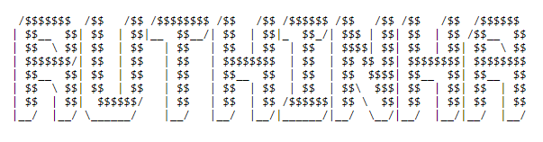

# Primeiro Passo

Instalar o Composer

``` curl -s https://getcomposer.org/installer | php ```

Criar uma pasta ```mkdir api```


Criar um arquivo  dentro da pasta api ```composer.json```

Colocar o seguinte conteúdo dentro do arquivo ```composer.json```
```
{
    "require": {
        "slim/slim": "2.*"
    }
}
```

Execute o comando ```composer install``` dentro da pasta ```api```